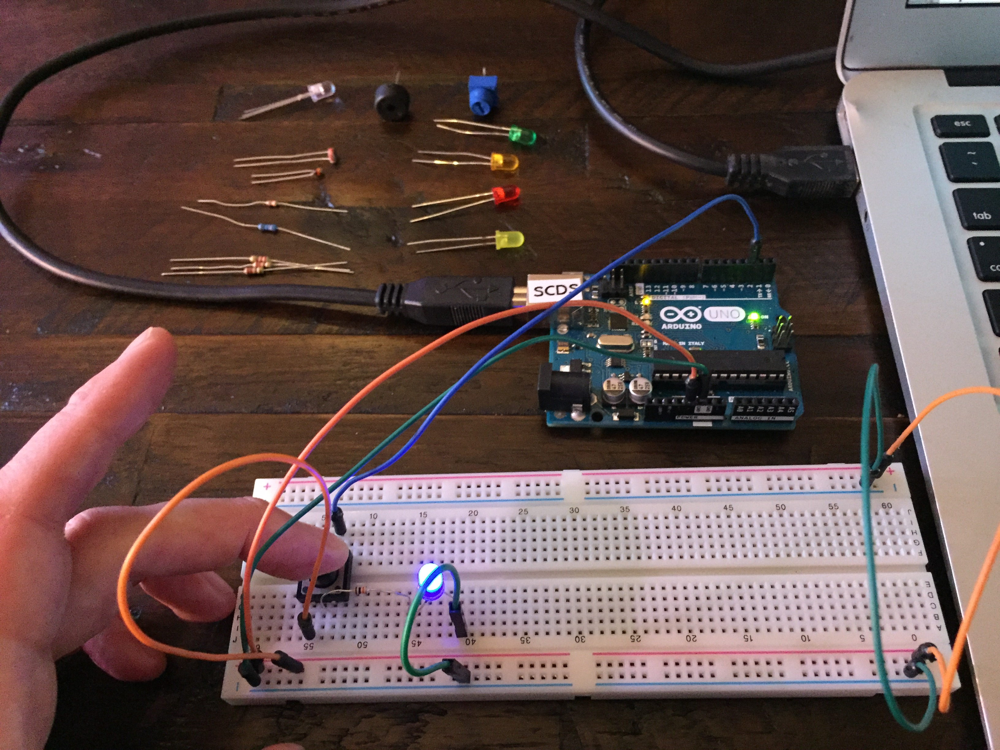

# Electronics & The Rest of Us Project
*Candace Adams*
<!--
Welcome to your project page for Electronics for the Rest of Us. You'll use this page to describe and showcase your work throughout the module. 
A place for each deliverable has been created below for you in this markdown document. 
Note that comments (such as this) will not appear in the final markdown document (which you can view with the "Preview" button).
-->


## Day 1: Reflection

Today, during the first day of this course we worked through steps to create and edit a webpage through GitHub, and GitHub Pages. Aside from initially having a trivial technical issue getting into the Teams meeting and joining a few minutes late, it was refreshingly simple and straightforward to accomplish and troubleshoot the tasks without any confusion or snags at all. Considering how little experience I have with any of this, it was surprisingly clear and the steps to work through it, along with Jay Brodeur’s guidance, helped me to have a better overall understanding of how to navigate GitHub. The use of Markdown to put in accurate syntax and formatting made it a breeze, though I am admittedly still inexperienced enough to still rely on it as a reference. I aim to commit the basic text prompts to memory, and explore the more complex capailities in Git Pages.

Getting to work with the actual Arduino UNO, and additional electronic components has so far been my favourite part. Working with a solderless breadboard, LEDs, Buttons, resistors to build a true circuit turned the worksheet projects into something tactile and fun. I'm not entirely sure of the direction I will take the kit and knowledge I've gained so far, but look forward to what's next.

<!--
In this section, provide a ~250 word reflection on your first day of the module, and discuss why you're interested in this module and what you hope to take away from it.

You're also asked to insert a photo that represents your accomplishments on your first day. 
- Take a photo of you working or one of your circuits and upload it to the /docs/images/ folder of this repository. 
- Then, insert your photo into your document by modifying the markdown example that has been inserted below.
-->

<!--
Inserting an image takes the form: 

See the following webpage for more information: https://github.com/adam-p/markdown-here/wiki/Markdown-Cheatsheet#images
Replace the elements below to insert your picture.
--> 


## Day 2: Results
In the next task, we built a thermometer, which was connected to an RDB LED light, that changed colours as temperature rose or fell. Initially this project was fairly straightforward, and worked quite reliably. For some reason, as I gained confidence and began experimenting with the temperature boundaries within the code, the colour change was less reliable and defaulted to blue more often than it should have. In the end some rewiring and refreshing a newly merged code seemed to fix this mysterious issue. Though this set me back a bit, as I jumped ahead to add a buzzer before uploading the code, it was ultimately a solid opportunity to troubleshoot and study the coding more. Check out my code for the [finished thermistor and LED here](thermistorLED.ino)

<!--
Upload your fully-commented Arduino sketch from your final Day 2 build task--a thermometer connected to an RDB LED--into your GitHub repository.
Provide a short (~150 words) summary of your work on this circuit:
- How does your device work?
- What was challenging? 
- What worked? What didn't? 
- Be sure to link to your code (in your GitHub repository) in the text of your response.
-->

## Arduino build-off results
<!--
Upload your fully-commented Arduino sketch from the final product of your Arduino build-off into the top-level of your module GitHub repository.
In ~300 words, provide a final device description and product pitch: 
- What does it do? Use a table (created in markdown) to list and describe the features. You can use the template provided below. 
- Describe briefly how it works.
- How could it be used in everyday life (or maybe just in rare cases)? 
- Be sure to link to your code (in your GitHub repository) in the text of your response.
- Include a snippet of code using the ``` ``` characters to display the code properly. 
Finally, record a short (30 second) video of a 'product pitch' for your device. 
- Upload the video to Youtube, and use the sample code below to embed your video.
-->


<!--
Below is a general markdown table template. 
You can find more information at these links: 
- https://github.com/adam-p/markdown-here/wiki/Markdown-Cheatsheet#tables

-->
| Feature | Description | Other Notes |
|---------|-------------|-------------|
|         |             |             |
|         |             |             |
|         |             |             |
|         |             |             |


<!--
Below is an example of embedding a YouTube video in a markdown document for use in GitHub pages. 
Note that this video won't show when previewing the document in GitHub--it only works on the GitHub pages webpage. 
- Once your YouTube video is uploaded, right click and select ```<> Copy embed code```. 
- You can paste this code directly into your markdown document. 
- Note that you may want to adjust the width and height parameters to make it fit well in your webpage
-->


## Final reflection & summary
This module was an absolute blast. There was plenty of tedious troubleshooting in some of the later projects, and because of this, I unfortunately did not get the time in to really explore the capabilities of the Arduino and come up with something new and unique. I essentially built a weather station that works to monitor temperature dropping in my indoor basement greenhouse, where I currently have the last round of seedlings growing before moving outside. The buzzer connected, along with the LED light switching from green to red, indicates when temperatures drop below 15 degrees, so that I can supplement heat as needed. In the future I'd like to sort out a way to elaborate on lighting and heat for plants without needing to supplement with something manually. Although these items already exist, and are pretty readily available in stores (timers, thermostats, growing kits with heat beds), it would be neat to build and st parameters from scratch, just to have a better understanding of complex codes and wiring. I've included [the coding for the device here](3rd-attempt-thermistorbuzzLED.ino), and contemplated leaving the Rick-Roll video embedded, because I did not complete uploading my own video, but figured everyone would be happier without it.

<!--
In ~300 words:
- Summarize your experience in this module. What you learned, what you liked, what you found challenging.
- Reflect upon your learning and its relevance in your life.
-->
